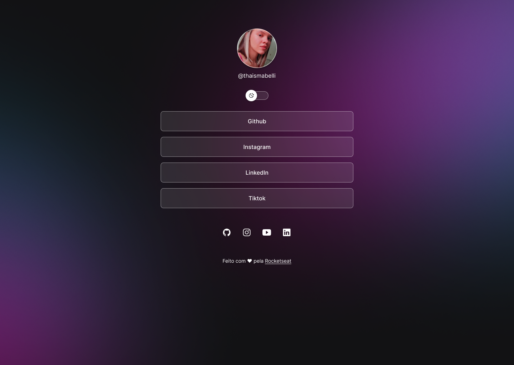

<h1 align="center"> Projeto HTML&CSS </h1>

Projeto realizado com HTML, CSS e JavaScript, do curso orientado pelo Mayk Brito da Rocketseat.  

  <a href="#-tecnologias">Tecnologias</a>&nbsp;&nbsp;&nbsp;|&nbsp;&nbsp;&nbsp;
  <a href="#-projeto">Projeto</a>&nbsp;&nbsp;&nbsp;|&nbsp;&nbsp;&nbsp;
  <a href="#memo-licença">Licença</a>

 

  

## 🚀 Tecnologias

Esse projeto foi desenvolvido com as seguintes tecnologias:

- HTML e CSS
- JavaScript
- Git e Github
- Figma

## 💻 Projeto

O ProjetoHTML&CSS é um agregador de links para usar como cartão de visitas online.

- [Acesse o projeto finalizado, online](https://thaismabelli.github.io/ProjetoHTML-CSS/)

## :memo: Licença

Esse projeto está sob a licença MIT.

---

Projeto realizado por Thais Mabelli, tendo como orientador o Mayk Brito do curso Programação do Zero da Rocketseat ♥ 